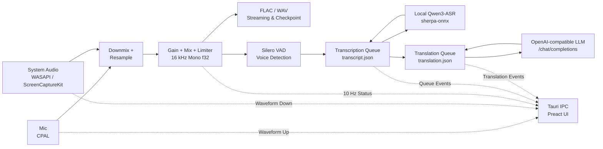
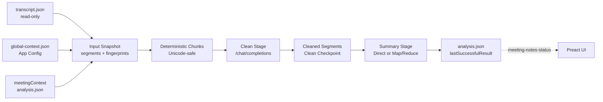

# Resonote Architecture

## Design Goals & Constraints

Resonote is designed to be a lightweight, local-first voice recorder and transcription tool with a strong emphasis on privacy and data reliability.

- **Rust-centric Core**: Recording, DSP, encoding, VAD, file I/O, and model management run entirely in Rust.
- **Decoupled Frontend**: The Preact WebView does not handle raw PCM data; it only receives status updates at 10 Hz.
- **Fail-safe Audio**: Main audio recording and file writes are decoupled from transcription. Transcription errors never disrupt recording.
- **Fail-safe Translation**: Translation runs on its own persistent queue. Endpoint failures never block recording or ASR.
- **Derived Meeting Notes**: Meeting notes are generated on demand from a finished transcript. The raw transcript stays read-only; every derived artifact lives in `analysis.json`.
- **Structural Secret Isolation**: API keys exist only in the private stored settings. The types written to session files, returned over IPC, or hashed into fingerprints cannot carry a key.
- **Crash Recovery**: Audio streams and session metadata (`session.json`) are checkpointed every 5 seconds. Atomic file writes prevent corruption.

## Data Flow

## Meeting Notes

Meeting notes are a manual, post-recording feature. They never touch audio and never rewrite the transcript.

- **Readiness Barrier**: Generation requires a terminal `session.json` and a `transcript.json` that is no longer `pending` or `processing`. A still-recording session, an unfinished transcript, an invalid transcript, or a transcript without usable text is rejected before any request is sent. An interrupted session or a `partial` transcript needs explicit confirmation and marks the result `partial`.
- **Frozen Input**: A run freezes the selected `complete`, non-empty segments, both context layers, the provider snapshot, and the output language into an `InputSnapshot`. Nothing is re-read while the run executes, so editing context mid-run cannot change a running job.
- **Two Fingerprints**: `inputFingerprint` is a SHA-256 over the canonical snapshot including prompt, chunker, and merge-policy versions, and excluding API keys; it drives idempotency and result reuse. `runFingerprint` adds a regeneration nonce so a forced regeneration is always a new run.
- **Clean Stage**: Chunking splits on sentence boundaries without breaking graphemes. Each `(segmentId, partIndex)` key must return exactly once and in order, or the chunk fails and is retried; segment identity, order, and timestamps never change.
- **Summary Stage**: A direct summary is used when the cleaned text fits the configured character budget. Otherwise map/reduce merges candidates level by level with a bounded depth, and equivalent statements keep the union of their source ids. Every `sourceSegmentIds` entry must resolve to a persisted cleaned segment, or the summary is rejected instead of committed.
- **No Audio Path**: The meeting-notes modules have no dependency on capture or storage audio code. Requests carry text only, never samples, file names, or paths.

## Context Model

Context is layered and lives in two different documents.

- **Global Context** (`global-context.json`, in the app config directory next to `settings.json`): stable facts reused across meetings — canonical name, aliases, frequent ASR mistakes, organizations, products, and recurring terminology.
- **Meeting Context** (`meetingContext` inside the session's `analysis.json`): background for one meeting — agenda, participants, prior facts and decisions, and per-meeting terminology.
- Both are versioned. Saves are compare-and-swap on the revision, so a stale editor cannot overwrite newer content, and saving byte-identical normalized content leaves the revision and existing results untouched.
- The two layers are never merged into a single blob. They travel as separate JSON data in the user message, meeting context outranks global context as a hint, and the prompt rules live only in the fixed system message.
- Each layer is capped at 20,000 rendered characters at save time; the merged rendering is capped at 30,000 characters when a run builds its snapshot, so oversized context fails early instead of being silently truncated.

## Threading & Lifecycle

- **Audio Callbacks**: Copy samples quickly to lock-free channels; no disk/model work in the callback thread.
- **Recording Loop (`resonote-recording`)**: Aligns inputs, runs DSP, writes audio, and performs VAD.
- **Transcription Service (`resonote-transcription`)**: Scans the persistent queue, processes segments sequentially, and manages ASR model lifetime.
- **Translation Service (`resonote-translation`)**: Translates completed ASR segments on a separate worker with a 60-second request timeout and persistent retries.
- **Meeting Notes Worker (`resonote-meeting-notes`)**: Runs one queued analysis at a time and checkpoints after every unit. Each unit is attempted at most three times with a fixed backoff supplied by an injectable sleeper, stopping is cooperative, and shutdown waits at most two seconds so quitting never hangs on a slow provider.
- **ASR Inference**: Runs synchronously on a worker thread. The ASR engine is released (via RAII) after a configurable idle timeout.
- **UI WebView**: Manages UI state and settings. Closing the window hides the app to the system tray, while background services keep running.

## Code Modules

- `capture.rs`: System-default audio capture (CPAL, WASAPI loopback, ScreenCaptureKit).
- `audio/dsp.rs`: Downmixing, gain control, mixing, RMS, and waveform summary.
- `audio/resample.rs`: Stateful resampling using `rubato`.
- `audio/flac.rs` & `audio/wav.rs`: Streamed, recoverable audio writers.
- `storage.rs`: Session directory structure, atomic JSON writes, and startup recovery.
- `vad.rs`: `sherpa-onnx` Silero VAD implementation.
- `models.rs` & `asr.rs`: Model catalog, validation, download resume, and `sherpa-onnx` Qwen3-ASR recognition.
- `transcription.rs`: Resumable queue management, ASR loading/unloading.
- `openai_compatible.rs`: Shared Chat Completions transport — URL normalization, auth rules, redirect and response-size policy, and error sanitization.
- `translation.rs`: Translation queue, atomic persistence, and crash recovery on top of the shared transport.
- `session_catalog.rs`: Registry of recording roots and the session-id resolver with path-safety validation.
- `session_lifecycle.rs`: Per-session lifecycle locks, `.deleting` markers, tombstones, and startup delete recovery.
- `meeting_notes.rs`: Meeting-notes service, job queue, state machine, idempotency, and recovery (`meeting_notes_worker.rs` holds the stage execution).
- `meeting_notes_document.rs`: Context types, `analysis.json` schema, checkpoints, validation, and atomic saves.
- `meeting_notes_pipeline.rs`: Readiness, snapshots, fingerprints, freshness, plus chunking, prompts, parsing, and reduce siblings.
- `recording.rs`: Orchestration of real-time audio components.
- `desktop.rs`: System tray, single-instance lock, and startup configuration.

## Persistence & State

- **`session.json`**: The source of truth for a recording session (duration, sample count, file structure). Strictly validated to prevent path traversal.
- **`transcript.json`**: Manages segment states (`pending`, `processing`, `complete`, `failed`). Segments in the `processing` state during a crash revert to `pending` upon restart. Failed segments are retried up to 3 times.
- **`translation.json`**: Stores the per-session endpoint/model/language snapshot and per-segment translations. Processing work returns to `pending` after a crash; failed requests retry up to 3 times.
- **`analysis.json`**: Stores the meeting context, the current run with its clean and summary checkpoints, and the last successful result. Only the meeting-notes worker writes it; `session.json` and `transcript.json` are never modified by meeting notes.
- **App config documents**: `settings.json` (including the private API keys), `global-context.json`, and `session-catalog.json` live in the app config directory and are written atomically.

## Session Catalog

- The catalog registers every canonical root the app records into: the default `recordings` directory plus any custom output directory from settings. Roots are canonicalized on registration.
- The frontend addresses a session by id and never by path. The resolver scans registered roots for the `session.json` claiming that id, rejects symlinks and anything escaping a root, and reports a conflict rather than guessing when two roots claim the same id.
- History's listing scans the default recordings root and truncates to 500 entries for display. That cap bounds the list only: resolution goes through the catalog, so reading, generating, and deleting still work for a session in a custom root or beyond the display cap.

## Recovery & Deletion

Startup recovers in a fixed order: finish interrupted deletions first, then recover recordings, translations, transcripts, and meeting notes. A half-deleted session therefore never re-enters a worker queue.

- **Transcription and translation**: `processing` segments return to `pending`, and retryable sessions re-enter their queue.
- **Meeting notes**: a `queued` run restarts, and a `cleaning` or `summarizing` run rewinds to its first uncommitted checkpoint unit. Committed units are never repeated; the uncommitted window is at-least-once.
- **Provider change**: if the endpoint, model, or auth mode behind a recovered run no longer matches the settings, the run fails with a stable error code instead of silently continuing with a different provider or key.
- **Corruption**: a corrupt checkpoint unit rewinds and reports its own error code while the last successful result stays readable. An unparsable `analysis.json` is renamed to `analysis.json.corrupt-<timestamp>` and the session is marked corrupt in memory, leaving the recording and raw transcript fully usable.

Deletion is ordered so that a crash at any point is recoverable:

1. `begin_delete` takes the session's lifecycle lock, records an in-memory tombstone, and creates a `.deleting` marker inside the session directory.
2. Every worker forgets the session — the transcription queue, the translation queue, and the meeting-notes job and queue.
3. `finish_delete` removes the directory under the same lock, so no worker can be halfway through a commit.

Workers check the tombstone under the lifecycle lock immediately before committing, and none of the atomic save functions for `transcript.json`, `translation.json`, or `analysis.json` will recreate a missing session directory. A response that arrives after the delete is dropped instead of reviving the session. A crash after any of the three steps leaves the marker behind, and the startup sweep finishes that deletion before any queue scan runs.

## Secret Boundary

- **Stored vs. view**: the settings store keeps the API keys privately. `get_settings` returns a view that reports an `apiKeyConfigured` flag per provider and never the value; `save_settings` accepts a secret-free settings payload plus explicit write-only key updates (keep, set, or clear).
- **Endpoint binding**: each key is stored together with the endpoint it was saved for. Pointing a provider at a different endpoint leaves the key unbound, the UI shows it as unconfigured, and no `Authorization` header is sent until the key is re-entered.
- **Structural exclusion**: the snapshot types persisted into session documents and hashed into fingerprints (`TranslationSnapshot`, `ProviderSnapshot`) carry endpoint, model, language, and auth mode only, so a key cannot reach a session file, an event, or a fingerprint.
- **In flight**: a job resolves its key from the store once and holds it in memory for the run. `SecretString` renders as `[REDACTED]` in `Debug` and has no `Display`, and the request type is deliberately neither `Serialize` nor `Debug`, so a request cannot be logged or persisted.
- **Transport rules**: bearer auth is allowed only over HTTPS or loopback, redirects are refused rather than followed, response bodies are capped at 2 MiB, and provider errors are reduced to a local error code plus HTTP status before they reach the UI, the logs, or `analysis.json`.

## Resource Policy

- **Zero-Dependency UI**: Uses the OS native WebView. Preact is bundled without virtual lists or heavy frameworks.
- **On-Demand Loading**: The selected ASR engine is loaded when speech is detected and unloaded after the configured idle timeout.
- **No Background Processes**: Inference runs inside the Resonote process; no local HTTP servers or sub-processes are spawned.

## Platform Notes

- **Windows**: Captures system audio via WASAPI Loopback. Requires system WebView2.
- **macOS**: Captures system audio via ScreenCaptureKit (macOS 13+). Requests Microphone and Screen Recording (for audio capture only) permissions.
- **Inference defaults**: macOS uses six CPU threads; Windows uses the conservative two-thread default. Saved user settings remain authoritative.

## Future Extensions

- **GPU Inference**: Add explicit provider configuration to `sherpa-onnx`.
- **Auto-Update**: Implement Tauri updater securely using HTTPS manifests and offline code signing keys.
- **Global Shortcuts**: Support hotkeys with custom capability permissions.
