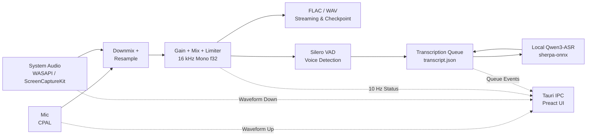

# Resonote Architecture

## Design Goals & Constraints

Resonote is designed to be a lightweight, local-first voice recorder and transcription tool with a strong emphasis on privacy and data reliability.

- **Rust-centric Core**: Recording, DSP, encoding, VAD, file I/O, and model management run entirely in Rust.
- **Decoupled Frontend**: The Preact WebView does not handle raw PCM data; it only receives status updates at 10 Hz.
- **Fail-safe Audio**: Main audio recording and file writes are decoupled from transcription. Transcription errors never disrupt recording.
- **Crash Recovery**: Audio streams and session metadata (`session.json`) are checkpointed every 5 seconds. Atomic file writes prevent corruption.

## Data Flow

## Threading & Lifecycle

- **Audio Callbacks**: Copy samples quickly to lock-free channels; no disk/model work in the callback thread.
- **Recording Loop (`resonote-recording`)**: Aligns inputs, runs DSP, writes audio, and performs VAD.
- **Transcription Service (`resonote-transcription`)**: Scans the persistent queue, processes segments sequentially, and manages ASR model lifetime.
- **ASR Inference**: Runs synchronously on a worker thread. The ASR engine is released (via RAII) after a configurable idle timeout.
- **UI WebView**: Manages UI state and settings. Closing the window hides the app to the system tray, while background services keep running.

## Code Modules

- `capture.rs`: System-default audio capture (CPAL, WASAPI loopback, ScreenCaptureKit).
- `audio/dsp.rs`: Downmixing, gain control, mixing, RMS, and waveform summary.
- `audio/resample.rs`: Stateful resampling using `rubato`.
- `audio/flac.rs` & `audio/wav.rs`: Streamed, recoverable audio writers.
- `storage.rs`: Session directory structure, atomic JSON writes, and startup recovery.
- `vad.rs`: `sherpa-onnx` Silero VAD implementation.
- `models.rs` & `asr.rs`: Model catalog, validation, download resume, and `sherpa-onnx` Qwen3-ASR recognition.
- `transcription.rs`: Resumable queue management, ASR loading/unloading.
- `recording.rs`: Orchestration of real-time audio components.
- `desktop.rs`: System tray, single-instance lock, and startup configuration.

## Persistence & State

- **`session.json`**: The source of truth for a recording session (duration, sample count, file structure). Strictly validated to prevent path traversal.
- **`transcript.json`**: Manages segment states (`pending`, `processing`, `complete`, `failed`). Segments in the `processing` state during a crash revert to `pending` upon restart. Failed segments are retried up to 3 times.

## Resource Policy

- **Zero-Dependency UI**: Uses the OS native WebView. Preact is bundled without virtual lists or heavy frameworks.
- **On-Demand Loading**: The selected ASR engine is loaded when speech is detected and unloaded after the configured idle timeout.
- **No Background Processes**: Inference runs inside the Resonote process; no local HTTP servers or sub-processes are spawned.

## Platform Notes

- **Windows**: Captures system audio via WASAPI Loopback. Requires system WebView2.
- **macOS**: Captures system audio via ScreenCaptureKit (macOS 13+). Requests Microphone and Screen Recording (for audio capture only) permissions.
- **Inference defaults**: macOS uses six CPU threads; Windows uses the conservative two-thread default. Saved user settings remain authoritative.

## Future Extensions

- **GPU Inference**: Add explicit provider configuration to `sherpa-onnx`.
- **Auto-Update**: Implement Tauri updater securely using HTTPS manifests and offline code signing keys.
- **Global Shortcuts**: Support hotkeys with custom capability permissions.
